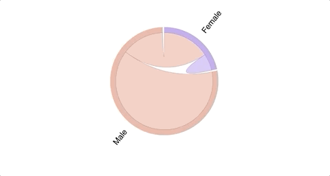

# Confusion Matrix Visualizations

Exploring methods for visualizing confusion matrices from machine learning models using R.

---

The data used in the following examples is an aggregate of three data sets from [Kaggle](https://www.kaggle.com/crowdflower/political-social-media-posts?fbclid=IwAR1zd5-O3bVc7oPH8ABHkiF524TM370lSZ44oR5_nQPfcwPlBFCHXbT-Vuc) and the [unitedstates](https://github.com/unitedstates/congress-legislators/blob/master/README.md) GitHub profile. The data used is provided in this repository in RData and CSV formats.

Additionally, these examples use machine learning models built using Naive Bayes (two and three class classifiers). A more in depth description of the data and machine learning models used can be found in my [data science portfolio](https://connersexton.github.io/politics/).

>The visualizations used in these examples utilize the [caret package's](https://cran.r-project.org/web/packages/caret/caret.pdf) **confusionMatrix()** function.

---

## Visualizing 2-Class Confusion Matrices

First, we'll look at some examples of plotting a confusion matrix for a 2 class model. These examples will use the aforementioned data on political messages to predict the gender of a given politician with Naive Bayes.

### 1. fourfoldplot (Base R)

```r
## store confusion matrix in object ("cm.gender")
cm.gender <- confusionMatrix(gender_test_labels, gender_test_pred, positive = "F")

## plot confusion matrix
fourfoldplot(cm.gender$table, color = c("#CC6666", "#99CC99"),
             conf.level = 0, margin = 1, main = "Confusion Matrix")
```

<figure>
    <a href="/images/2-class-fourfoldplot.png"></a>
</figure>

While the fourfoldplot() function is convenient as it's a Base R function and doesn't require much data preprocessing, it only supports 2-class machine learning models.

### 2. draw_confusion_matrix() function

The draw_confusion_matrix() function was initially written by [@Cybernetic](https://stackoverflow.com/users/1639594/cybernetic) on Stack Overflow. The code that I've tweaked a bit comes from [@Breck](https://stackoverflow.com/users/9743526/breck)'s modifications to Cybernetic's code. The function uses Base R graphics to build clean visuals to display the results and confusion matrix of a given 2-class machine learning model.

>This function only supports 2-class models, but I've rewritten the code to support 3-class models, which is reflected in my examples of 3-class visualizations. The code for this function is included in this repository.

```r
## with draw_confusion_matrix() function:
draw_confusion_matrix(cm.gender, 2)
## inputs:
# - caret package confusion matrix object
# - number of classes the model predicts
```

<figure>
    <a href="/images/2-class-cybernetic.png"></a>
</figure>

Color ramps on confusion matrix rectangles:

- opacity indicates strength of a given prediction (lighter indicates less, darker indicates more)

- color indicates whether the prediction was true or false (red indicates a false prediction and green, a true prediction)

### 3. Chord Diagram (choorddiag)

The [**corddiag**](https://github.com/mattflor/chorddiag) R-package was developed by [Matt Flor](https://github.com/mattflor) and can be used to visualize confusion matrices. Flor's package uses JavaScripts D3 visualization library to create interactive chord diagrams. I've added html files to the *images* folder in this repository, which contain the interactive javascript plots.

```r
library(chorddiag)

# create graph matrix:
cm.gender.d3 <- matrix(c(70, 200,
                         179, 801),
                       byrow = TRUE,
                       nrow = 2,
                       ncol = 2)

cm.gender.d3.names <- c("Female", "Male")
dimnames(cm.gender.d3) <- list(have = cm.gender.d3.names,
                               prefer = cm.gender.d3.names)

cm.gender.d3.colors <- c("#B79AE8", "#E8AC9A")
chorddiag(cm.gender.d3,
          groupColors = cm.gender.d3.colors,
          groupnamePadding = 20,
          showTicks = F)
```

<figure>
    <a href="/images/D3/2-class-d3-screencap.png"></a>
</figure>




I find this visualization particularly helpful in its ability to visually articulate false negatives and false positives. It's interesting to see the source of these misclassifications, especially when you're working with more than two classes, which we'll see below.


## Visualizing 3-Class Confusion Matrices

Now we'll look at some sample visualizations for a 3-Class confusion matrix. These examples will use the aforementioned data on political messages to predict the party (Democrat, Independent, or Republican) of a given politician with Naive Bayes.

### 1. draw_confusion_matrix() function

As mentioned above, I've modified [@Cybernetic's](https://stackoverflow.com/users/1639594/cybernetic) original code to support a 3-class confusion matrix.

```r
## Store confusion matrix in object ("cm.party")
cm.party <- confusionMatrix(party_test_labels, party_test_pred, positive = "Democrat")

## with draw_confusion_matrix() function:
draw_confusion_matrix(cm.party, 3)
## inputs:
# - caret package confusion matrix object
# - number of classes the model predicts
```

<figure>
    <a href="/images/3-class-cybernetic.png"></a>
</figure>

### 2. Chord Diagram (choorddiag)

```r
# create graph matrix:
cm.party.d3 <- matrix(c(300, 37, 171,
                        3, 13, 4,
                        207, 42, 473),
                       byrow = TRUE,
                       nrow = 3,
                       ncol = 3)
cm.party.d3.names <- c("Democrat", "Independent", "Republican")
dimnames(cm.party.d3) <- list(have = cm.party.d3.names,
                               prefer = cm.party.d3.names)
# aquamarine4, coral2
cm.party.d3.colors <- c("#7FC5E5", "#A1E57F", "#E5867F")
chorddiag(cm.party.d3,
          groupColors = cm.party.d3.colors,
          groupnamePadding = 20,
          showTicks = F)
```

<figure>
    <a href="/images/D3/3-class-d3-screencap.png"></a>
</figure>


### 3. ggplot2

Using the [ggplot2 package](https://cran.r-project.org/web/packages/ggplot2/ggplot2.pdf) allows for more flexibility when customizing your confusion matrices. The following example takes advantage of ggplot2's geom_point() function.

>I should also note that configuring the size of each point so they reflect the count of classifications is also a strong visualization choice. But for this example, the range was too high to produce a clear plot.

```r
cm.party.ggplot <- data.frame(predicted = rep(c("Democrat", "Independent", "Republican"), each = 3),
                              actual = rep(c("Democrat", "Independent", "Republican"), times = 3),
                              values = c(300, 37, 171,
                                         3, 13, 4,
                                         207, 42, 473))
cm.party.ggplot %>%
  mutate(correct = ifelse(predicted == actual, 1, 0),
         predicted = factor(predicted,
                            levels = c("Republican", "Independent", "Democrat"))) -> cm.party.ggplot

ggplot(cm.party.ggplot, aes(actual, predicted))+
  geom_point(aes(fill = factor(correct)), shape = 21, size = 20)+
  geom_text(aes(label = cm.party.ggplot$values), size = 4)+
  scale_fill_manual(values = c("#DF8982", "#82DF88"))+
  scale_x_discrete(position = "top")+
  theme_minimal()+
  theme(legend.position = "none")+
  labs(title = "Confusion Matrix",
       x = "Actual",
       y = "Predicted")
```

<figure>
    <a href="/images/3-class-ggplot.png"></a>
</figure>
